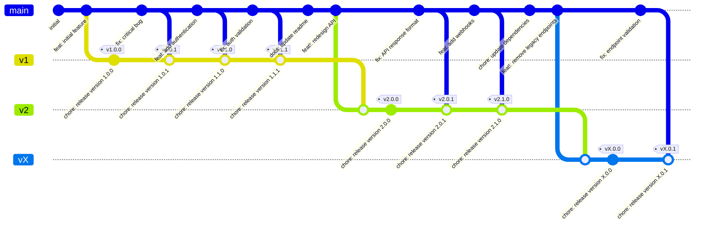

# Conventional Release Action

A simple, opinionated GitHub Action for automatic releases. It analyzes the latest commit using conventional commit format and creates releases with semantic versioning.

## Philosophy

This action is **simple and opinionated** by design:

- ✅ Only analyzes the latest commit upon release
- ✅ Uses conventional commit format for version bumping
- ✅ Follows semantic versioning strictly
- ✅ Minimal configuration required
- ✅ Fast and predictable releases

## How It Works

The action analyzes the **latest commit** on your main branch to determine if a release should be created. It expects your repository to be configured for **squash commits only** with the PR title as the commit message.

### Commit Strategy



This diagram shows the actual branching strategy:

- **Main branch**: Continuous development with conventional commits
- **Version branches**: `v1`, `v2`, `vX` created for each major version line
- **Release pattern**:
  1. Feature/fix commits land on main
  2. Action merges main into version branch
  3. Creates release commit with version bump and tag
- **Chained releases**: Each version builds on the previous (v1.0.0 → v1.0.1 → v1.1.0 → v1.1.1)
- **Breaking changes**: `feat!` triggers new major version branch (v1 → v2 → vX)
- **Non-release commits**: `docs:`, `chore:` stay on main, don't trigger releases

The action analyzes the latest commit on main, and if it qualifies for release, merges main into the appropriate version branch and creates a tagged release commit.### Repository Configuration Requirements

For optimal results, configure your repository with:

1. **Squash commits only**: Go to Settings → General → Pull Requests → "Allow squash merging" only
2. **Default merge message**: Set to "Pull request title" so the PR title becomes the commit message
3. **PR title validation**: The action validates PR titles against conventional commit format during CI

When a PR is merged, the squash commit message will be the PR title, which the action then analyzes for release decisions.

## Features

- 🚀 **Automated Releases**: Create GitHub releases automatically based on the latest commit
- 📝 **Conventional Commits**: Full conventional commit spec support for version determination
- ⚙️ **Simple Config**: Minimal TOML configuration
- 🏷️ **Smart Versioning**: Semantic versioning with git tags
- 🐳 **Dockerized**: Consistent execution environment

## Quick Start

1. Create a configuration file `.release-config.toml` in your repository root:

```toml
[version]
strategy = "git_tags"
initial_version = "0.1.0"
tag_prefix = "v"
```

2. Add the workflow to `.github/workflows/release.yml`:

```yaml
name: Release

on:
  push:
    branches: [main]

permissions:
  contents: write

jobs:
  release:
    runs-on: ubuntu-latest
    steps:
      - uses: actions/checkout@v4
        with:
          fetch-depth: 0

      - name: Create Release
        uses: NicoKNL/conventional-release-action@v1
        with:
          github-token: ${{ secrets.GITHUB_TOKEN }}
```

3. (Optional) Add PR title validation to `.github/workflows/pr-validation.yml`:

```yaml
name: PR Validation

on:
  pull_request:
    types: [opened, edited, synchronize]

jobs:
  validate:
    runs-on: ubuntu-latest
    steps:
      - uses: actions/checkout@v4

      - name: Validate PR Title
        uses: NicoKNL/conventional-release-action@v1
        with:
          github-token: ${{ secrets.GITHUB_TOKEN }}
```

## Configuration

The action uses git tags to determine versioning. Configuration is simple and opinionated:

```yaml
version:
  initial_version: "0.1.0"
  tag_prefix: "v"
  tag_suffix: ""
```

### Configuration Options

- `initial_version` - Version to use if no previous tags are found (default: "0.1.0")
- `tag_prefix` - Prefix for git tags (default: "v")
- `tag_suffix` - Suffix for git tags (default: "")

### File Updates

Configure which files should be updated with new version information during releases:

```toml
[[version.files]]
path = "Cargo.toml"
marker = "0.0.0+local"

[[version.files]]
path = "package.json"
marker = "0.0.0+local"

[[version.files]]
path = "action.yml"
marker = "v0.0.0+local"
template = "docker://ghcr.io/nicoknl/conventional-release-action:v{version}"
```

**File Update Options:**

- `path` - Path to the file to update
- `marker` - String to replace with the new version
- `template` (optional) - Template for the replacement (use `{version}` placeholder)

The action will replace all occurrences of the `marker` with either the version number directly, or with the `template` where `{version}` is substituted with the actual version.

### Version Bumping

The action analyzes the latest commit message using conventional commit format to determine version bumps:

- `feat:` → Minor version bump (e.g., 1.0.0 → 1.1.0)
- `fix:` → Patch version bump (e.g., 1.0.0 → 1.0.1)
- `feat!:` or `BREAKING CHANGE:` → Major version bump (e.g., 1.0.0 → 2.0.0)
- Other types (`docs:`, `chore:`, `style:`, etc.) → No release

The action only creates a release when the latest commit follows conventional commit format and represents a semantic change.

## Inputs

| Input          | Description                   | Required | Default                |
| -------------- | ----------------------------- | -------- | ---------------------- |
| `github-token` | GitHub token for API access   | Yes      | -                      |
| `config-file`  | Path to configuration file    | No       | `.release-config.toml` |
| `dry-run`      | Run without creating releases | No       | `false`                |

## Outputs

| Output        | Description                       |
| ------------- | --------------------------------- |
| `released`    | Whether a release was created     |
| `version`     | The version that was released     |
| `tag`         | The git tag that was created      |
| `release-url` | URL of the created GitHub release |

## Examples

### Basic Rust Project

```toml
# .release-config.toml
[version]
strategy = "git_tags"
initial_version = "0.1.0"
tag_prefix = "v"
```

### Node.js Project with Package.json

```toml
# .release-config.toml
[version.strategy.file]
path = "package.json"
format = "package_json"
```

## Docker Images

The action uses pre-built Docker images hosted on GitHub Container Registry for fast execution:

- **Latest**: `ghcr.io/nicoknl/conventional-release-action:latest` (automatically updated with releases)
- **Versioned**: `ghcr.io/nicoknl/conventional-release-action:v1.0.0` (pinned to specific version)

Docker images are automatically built and published **only when a release is created**, ensuring that every published image corresponds to a tagged version.

### Using Specific Versions

For production use, pin to a specific version by updating your action.yml:

```yaml
runs:
  using: "docker"
  image: "docker://ghcr.io/nicoknl/conventional-release-action:v1.0.0"
```

This ensures reproducible builds and prevents unexpected changes from affecting your workflows.

## Development

This action is built with Rust and runs in a Docker container.

### Building Locally

```bash
cargo build --release
```

### Running Tests

```bash
cargo test
```

### Docker Build

```bash
docker build -t conventional-release-action .
```

## Contributing

1. Fork the repository
2. Create a feature branch
3. Make your changes
4. Add tests if applicable
5. Submit a pull request

## License

MIT License - see [LICENSE](LICENSE) for details.
